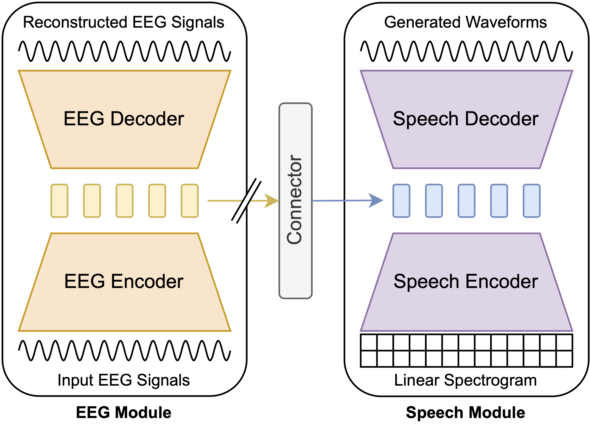

# Toward Fully-End-to-End Listened Speech Decoding from EEG Signals
### Jihwan Lee, Aditya Kommineni, Tiantian Feng, Kleanthis Avramidis, Xuan Shi, Sudarsana Kadiri, and Shrikanth Narayanan

### Code implementation for [paper](https://www.isca-archive.org/interspeech_2024/lee24c_interspeech.html "Toward Fully-End-to-End Listened Speech Decoding from EEG Signals") accepted at Interspeech 2024

### Update (January, 2025)
An improved subsequent version of the work is available [here](https://github.com/lee-jhwn/icassp25-fesde-phoneme "Enhancing Listened Speech Decoding from EEG via Parallel Phoneme Sequence Prediction").

## Abstract
Speech decoding from EEG signals is a challenging task, where brain activity is modeled to estimate useful characteristics of acoustic stimuli. We propose **FESDE**, a novel framework for **F**ully-**E**nd-to-end **S**peech **D**ecoding from **E**EG signals. Our approach aims to directly reconstruct listened speech waveforms given EEG signals, and it does not require any intermediate acoustic feature processing step. The proposed method consists of an EEG module and a speech module along with the connector. The EEG module learns to better represent noisy EEG signals, while the speech module generates speech waveforms from model representations. The connector learns to bridge the distributions of the latent spaces of EEG and speech. The proposed framework is both simple and efficient, by allowing single-step inference, and outperforms prior works on objective metrics. A fine-grained phoneme analysis is conducted to unveil model characteristics of speech decoding.




## Environment
- Recommended: `Python >=3.8`
- Install required python packages. 
    - Refer to `requirements.txt`
    - e.g.) `pip install -r requirements.txt`


## Training Exmaple
### Pre-training the EEG module only
```sh
python3 pretrain_eeg_module.py -c configs/config.json -m <run_name>
```
### Training the whole network
```sh
python3 train.py -c configs/config.json -m <run_name>
```

## Inference Exmaple
```sh
python3 inference.py --run_name <run_name> --checkpoint_idx <checkpoint_index>
```


## References
#### We adopt some of the backbone code from the following repos:
- Speech Module: https://github.com/jaywalnut310/vits 
- EEG Module: https://github.com/Uncertain-Quark/s4_eeg

## Contact
- Jihwan Lee <jihwan@usc.edu>
